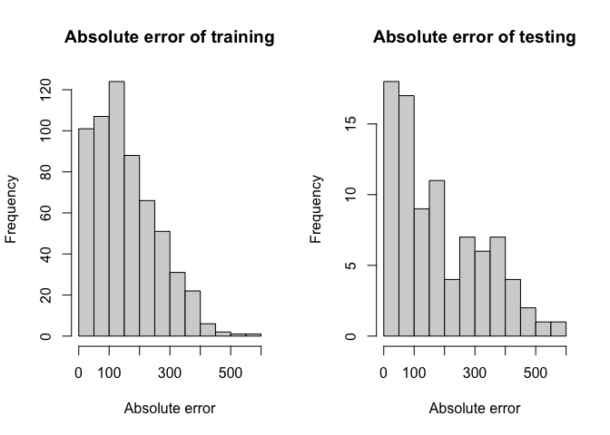
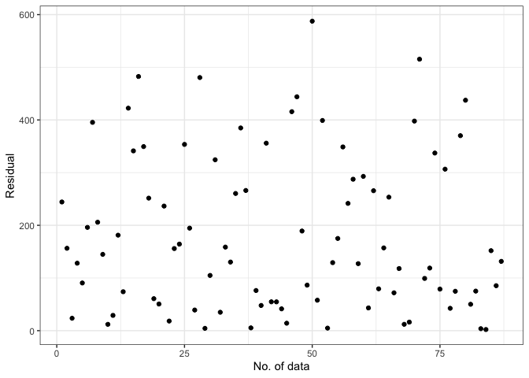

<!-- README.md is generated from README.Rmd. Please edit that file -->

# bis620.2023

<!-- badges: start -->

[](https://github.com/anranjiao/bis620.2023.final/actions/workflows/R-CMD-check.yaml)
[](https://github.com/anranjiao/bis620.2023.final/actions/workflows/test-coverage.yaml)
<!-- badges: end -->

## Installation

You can install the development version of bis620.2023.final from
[GitHub](https://github.com/) with:

``` r
# install.packages("devtools")
# devtools::install_github("anranjiao/bis620.2023.final")
```

## Description

The dataset investigated in this project originates from the PRIME
(Panitumumab Randomized Trial in Combination with Chemotherapy for
Metastatic Colorectal Cancer to Determine Efficacy). This study was
conducted to assess the impacts of panitumumab treatment on top of the
standard FOLFOX treatment compared to FOLFOX alone for metastatic
colorectal cancer. We utilize three different models to predict the
death days of the patients and the side effect such as rash.

## Examples

These are some basic examples:

``` r
library(bis620.2023.final)

data("adsl")
data("biomark")
dataset = preprocessing(adsl, biomark, 600)
data = random_forest(dataset)
plot_histogram(data, 12)
```



    #> $breaks
    #>  [1]   0  50 100 150 200 250 300 350 400 450 500 550 600
    #> 
    #> $counts
    #>  [1] 20 15  9 11  5  6  5  7  5  3  0  1
    #> 
    #> $density
    #>  [1] 0.0045977011 0.0034482759 0.0020689655 0.0025287356 0.0011494253
    #>  [6] 0.0013793103 0.0011494253 0.0016091954 0.0011494253 0.0006896552
    #> [11] 0.0000000000 0.0002298851
    #> 
    #> $mids
    #>  [1]  25  75 125 175 225 275 325 375 425 475 525 575
    #> 
    #> $xname
    #> [1] "abs(pa_test$pred - pa_test$actual)"
    #> 
    #> $equidist
    #> [1] TRUE
    #> 
    #> attr(,"class")
    #> [1] "histogram"

    data("adae")
    dataset = preprocessing_rash(adsl, biomark, adae, 800)
    data = random_forest_rash(dataset)
    plot_histogram(data, 12)



    #> $breaks
    #>  [1] 0.0 0.1 0.2 0.3 0.4 0.5 0.6 0.7 0.8 0.9 1.0
    #> 
    #> $counts
    #>  [1] 45 15  5 14 16 19  7  4  4  2
    #> 
    #> $density
    #>  [1] 3.4351145 1.1450382 0.3816794 1.0687023 1.2213740 1.4503817 0.5343511
    #>  [8] 0.3053435 0.3053435 0.1526718
    #> 
    #> $mids
    #>  [1] 0.05 0.15 0.25 0.35 0.45 0.55 0.65 0.75 0.85 0.95
    #> 
    #> $xname
    #> [1] "abs(pa_test$pred - pa_test$actual)"
    #> 
    #> $equidist
    #> [1] TRUE
    #> 
    #> attr(,"class")
    #> [1] "histogram"

## Test Coverage

[Link](https://github.com/anranjiao/bis620.2023.final/actions/runs/7280401561)
